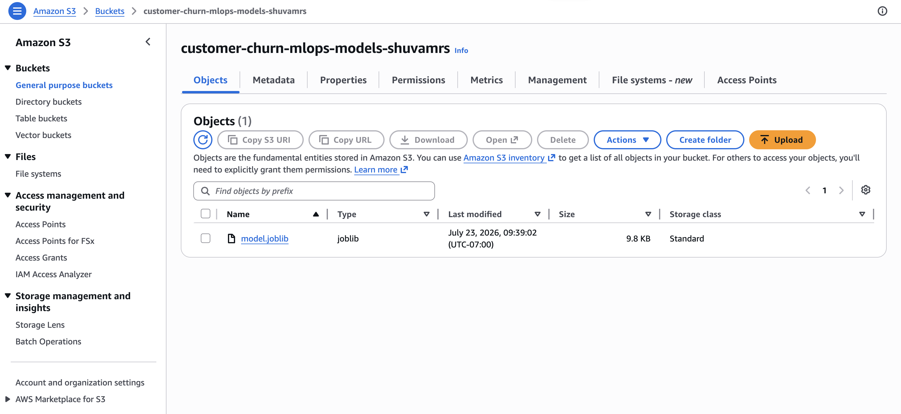
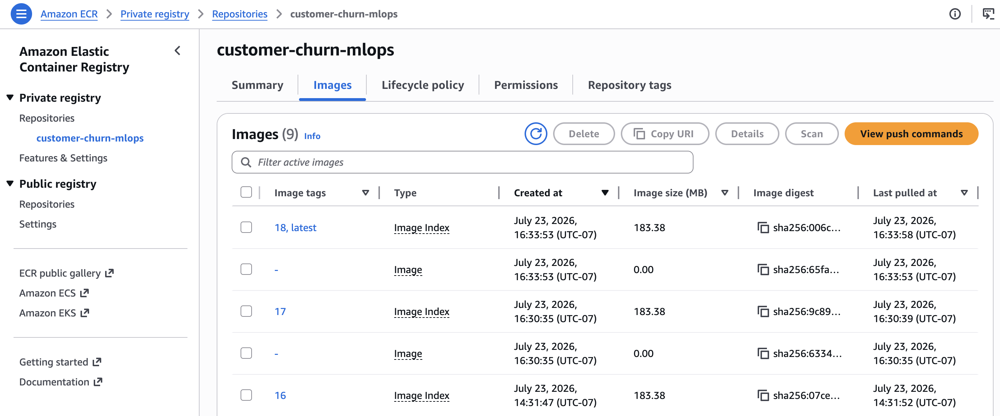
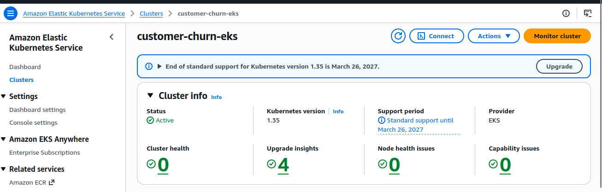
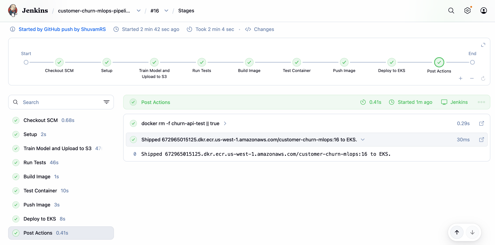

# Customer Churn MLOps Pipeline

This project implements an end-to-end MLOps pipeline for a scikit-learn customer churn model on AWS.

A key design choice is that the trained model is stored separately from the Docker image. Jenkins trains the model and uploads `model.joblib` to Amazon S3. The Docker image contains only the FastAPI serving code and dependencies. When the container starts on Amazon EKS, `app.py` downloads the model from S3, loads it, and serves predictions.

## Architecture

```text
GitHub push
    ↓
GitHub webhook
    ↓
Jenkins pipeline
    ↓
Train model and upload model.joblib to Amazon S3
    ↓
Run tests
    ↓
Build serving-only FastAPI Docker image
    ↓
Push Docker image to Amazon ECR
    ↓
Apply Kubernetes manifests to EKS
    ↓
Update the live Kubernetes Deployment to use the new ECR image tag
    ↓
EKS worker node pulls the Docker image from ECR
    ↓
Container starts and app.py downloads model.joblib from S3
    ↓
LoadBalancer exposes /health and /predict
```

## Tech Stack

| Area | Tools |
|---|---|
| Machine learning | Python, pandas, scikit-learn |
| API serving | FastAPI, Uvicorn |
| Testing | pytest |
| Model artifact storage | Amazon S3 |
| Containerization | Docker |
| Image registry | Amazon ECR |
| Infrastructure | Terraform |
| Orchestration | Kubernetes, Amazon EKS |
| CI/CD | Jenkins, GitHub webhook |

## What This Project Builds

### 1. Model Training and S3 Artifact Storage

`train.py` trains the churn model, evaluates it, applies quality checks, saves the trained model as `model.joblib`, and uploads that artifact to Amazon S3.

```text
train.py → model.joblib → Amazon S3
```

<p align="center">
  
</p>

This keeps the model artifact separate from the application image.

### 2. FastAPI Prediction Service

`app.py` is the API service.

At startup, it reads the S3 configuration from environment variables, downloads `model.joblib`, loads the model, and exposes:

```text
GET  /health
POST /predict
```

Example `/health` response:

```json
{
  "status": "ok",
  "model_metrics": {
    "accuracy": 0.7672,
    "precision": 0.5479,
    "recall": 0.7032,
    "f1": 0.6159,
    "roc_auc": 0.8426
  }
}
```

Example `/predict` response:

```json
{
  "churn": true,
  "churn_probability": 0.8121,
  "threshold": 0.61
}
```

### 3. Serving-Only Docker Image

The Docker image is intentionally focused on serving the API.

It contains:

```text
app.py
requirements.txt
installed Python dependencies
```

It does not contain:

```text
training dataset
train.py
model.joblib
```

This separates model training from model serving. Jenkins trains the model first, uploads the model to S3, and then builds the API image.

### 4. Amazon ECR Image Registry

Jenkins pushes the Docker image to Amazon ECR with two tags:

```text
latest
<JENKINS_BUILD_NUMBER>
```

The numbered tag identifies the Jenkins build that produced the image, while `latest` points to the most recent image.

<p align="center">
  
</p>

### 5. Kubernetes Deployment on EKS

Terraform creates the EKS cluster, and Kubernetes runs the FastAPI container.

The Kubernetes setup includes:

```text
ConfigMap  → passes S3 bucket, model key, and AWS region to the app
Deployment → runs the FastAPI container from the ECR image
Service    → exposes the API through a LoadBalancer
```

The Deployment also includes CPU/memory requests and `/health` probes for readiness and liveness.

The repository `deployment.yaml` uses `latest` as a baseline image. During the Jenkins deployment stage, Jenkins updates the live Kubernetes Deployment to use the exact Jenkins build-number image tag. This update happens inside the EKS cluster; it does not edit the `k8s/deployment.yaml` file in GitHub.

<p align="center">
  
</p>

### 6. Jenkins CI/CD Pipeline

Jenkins automates the full workflow after a GitHub push.

Pipeline stages:

```text
Setup
Train Model and Upload to S3
Run Tests
Build Image
Test Container
Push Image
Deploy to EKS
```

In the deploy stage, Jenkins:

```text
applies the Kubernetes ConfigMap, Deployment, and Service
updates the live Deployment to use the new ECR image tag
waits for the rollout to complete
checks pods and service status
```

<p align="center">
  
</p>

## Key Design Choices

- The trained model is stored in S3 instead of being packaged with the Docker image.
- The Docker image contains only the FastAPI serving application and dependencies.
- Jenkins trains and tests before building and deploying the image.
- ECR stores both `latest` and build-number image tags.
- Jenkins updates the live Kubernetes Deployment to use the exact build-number image tag.
- EKS worker nodes pull the Docker image from ECR.
- The running container downloads `model.joblib` from S3 at startup.
- Kubernetes uses a ConfigMap for non-secret S3 settings.
- The EKS worker nodes have permission to read the model artifact from S3.
- Terraform creates the AWS infrastructure before Jenkins deploys the application.